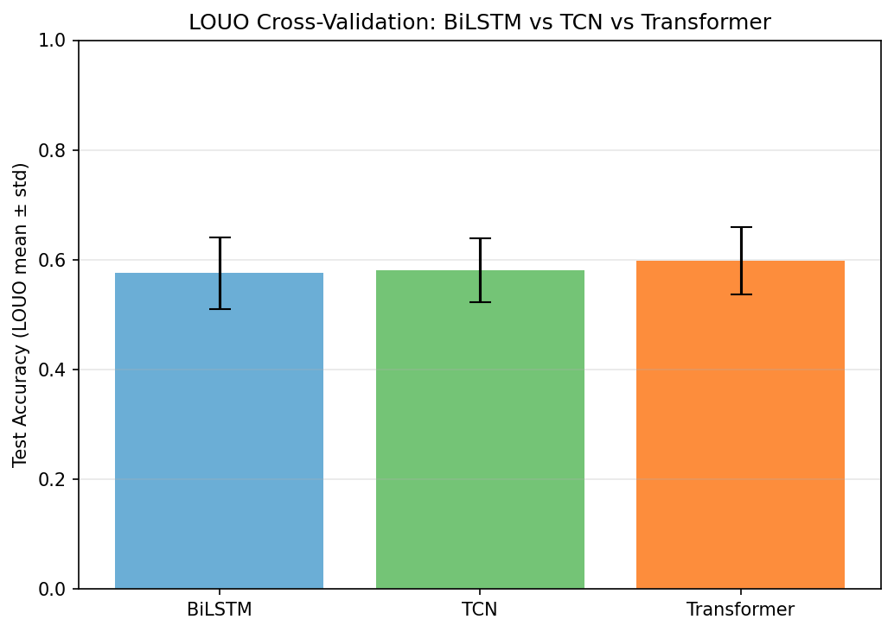
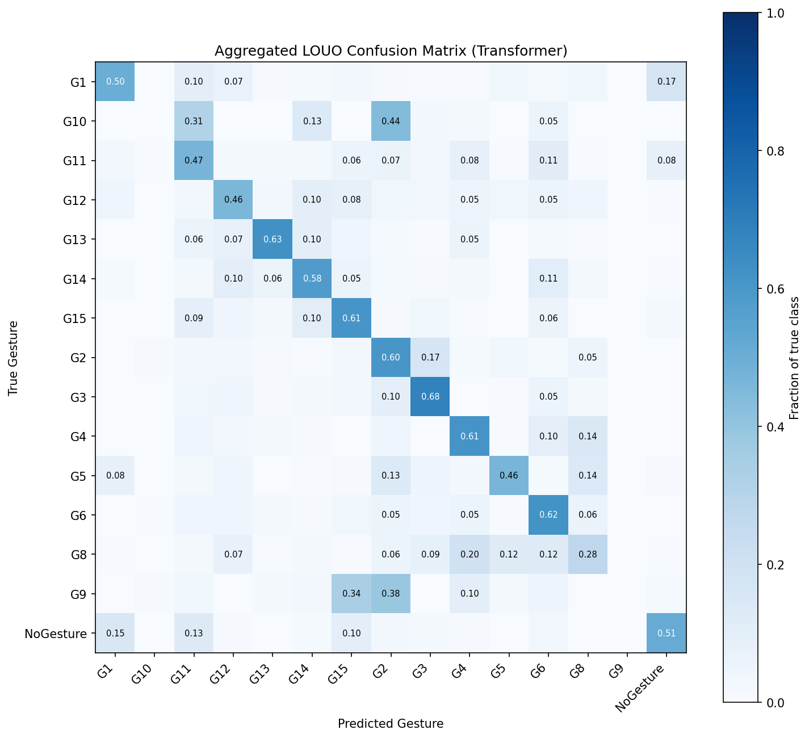
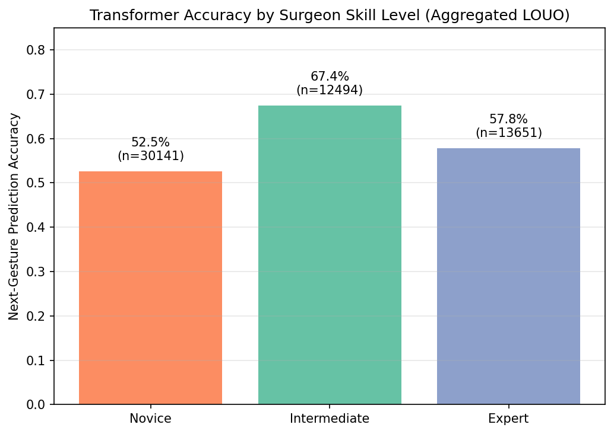
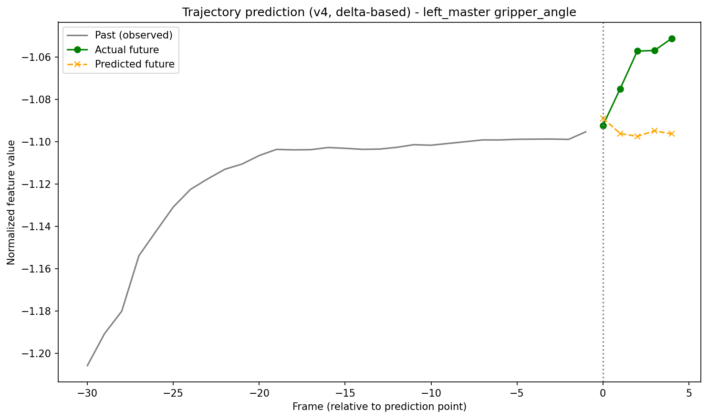
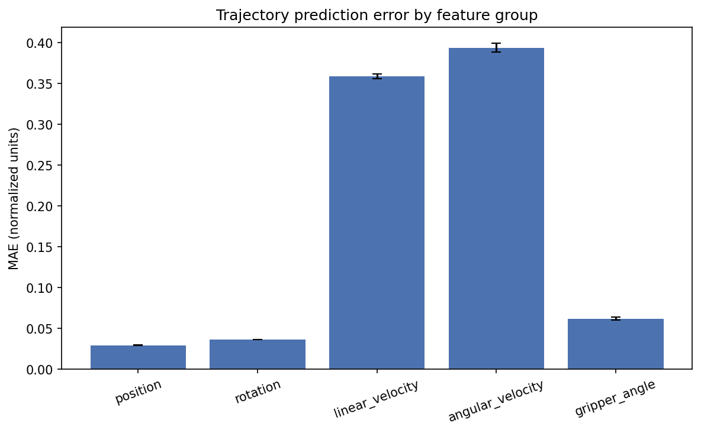

# Surgical Gesture Prediction from Kinematic Demonstrations

Predicting a surgeon's **next gesture** during robot-assisted surgery from a short
window of past kinematic data (da Vinci master/slave arm positions, rotations,
velocities, and gripper angle), trained via behavioral cloning on the JIGSAWS
dataset (Suturing, Knot Tying, Needle Passing).

This is a step toward AR-guided surgical training: a model that anticipates what
happens next in a procedure, rather than only recognizing what already happened.


## Demo

https://github.com/user-attachments/assets/c0e70a76-e4e0-4526-bc2f-fcc26b0f9187


The demo is a **recorded walkthrough**, not a live hosted app. The video frame,
the model's top-5 predicted next gesture, and the ground-truth label update
together as playback advances, so you can see where the model tracks the
surgeon correctly and where it gets confused (e.g. around gesture transitions).

**Why not a live demo?** JIGSAWS is distributed under an academic-access
agreement with JHU/CIRL, not an open license — redistributing its video clips
through a public hosted demo (e.g. Hugging Face Spaces) isn't consistent with
that agreement. The interactive Gradio dashboard used to record this demo is
included in `notebooks/`, and runs locally for anyone who has requested their
own copy of the dataset (see [Data Access](#data-access) below).

## Is this useful for AR guidance?

Partially, and it's worth being precise about the scope. The model predicts the
**next gesture** (a segment typically spanning hundreds of frames — e.g. "orient
needle," "push needle through tissue"), not the next few frames of hand motion.
That makes it suited to **workflow-level** AR assistance — e.g. pre-staging the
next instrument, or flagging an upcoming high-risk step — rather than
frame-by-frame motion overlays on the surgeon's hands, which would need a
different (much higher-frequency) prediction target.

## Results

### Architecture comparison

Three architectures were compared, from simple to advanced, all predicting the
next gesture from a 30-frame kinematic window:

| Model | Random split (naive) | LOUO cross-validation (rigorous) |
|---|---|---|
| BiLSTM | ~80.7% val acc | 57.6% ± 6.6% |
| TCN | ~79.3% val acc | 58.1% ± 5.9% |
| **Transformer** | ~82.1% val acc | **59.8% ± 6.1%** |

**Why two numbers per model:** a random train/val split lets frames from the
*same surgeon* appear on both sides of the split, so the model can partly learn
a surgeon's personal style rather than the task itself — inflating accuracy by
~20 points. **Leave-One-User-Out (LOUO)** cross-validation — train on 7
surgeons, test on the 8th, repeated for all 8 — is the standard, harder,
clinically meaningful protocol: it measures generalization to a surgeon the
model has never seen. All numbers reported below use LOUO.



### Error analysis (Transformer, aggregated across all LOUO folds)



- **Rare gestures are effectively unlearned.** G9 and G10 (the least frequent
  classes in the dataset) score 0% precision/recall and are almost always
  misclassified as the majority class G2. A deployed system trained this way
  would silently fail on exactly the gestures it has seen least — often the
  more unusual or technically demanding ones.
- **Most confusion happens between kinematically similar or adjacent actions**,
  not random noise: G8→G4 (19.8%), and G1↔NoGesture (15–17%, most likely a
  boundary-labeling ambiguity at the start/end of a gesture rather than a true
  model error).

### Accuracy by surgeon skill level



| Skill level | Accuracy |
|---|---|
| Novice | 52.5% |
| Intermediate | **67.4%** |
| Expert | 57.8% |

The naive expectation is that expert surgeons, being more consistent, should be
the easiest to predict. That isn't what happened. A plausible explanation:
experts tend to develop efficient, individualized shortcuts that diverge from
the "average" pattern the model learns across surgeons, while novices are
simply the most erratic (hesitations, corrective movements) and hardest to
predict for anyone. This should be read as a hypothesis, not a conclusion — the
number of expert trials in JIGSAWS is small, so this pattern needs a larger
cohort to confirm.

## Trajectory prediction (motion-level extension)

Gesture prediction (above) operates at the workflow level — segments spanning
hundreds of frames. As a complementary, finer-grained extension, a second
Transformer model predicts the **next 5 frames (~160ms) of raw kinematics**
(all 76 features) from the same 30-frame input window — closer to what a
frame-by-frame AR motion overlay would need.



**Architecture note:** the 5 future frames are predicted **directly, in a
single forward pass** (one linear layer outputs all `horizon x 76` values at
once) — not autoregressively, where each predicted frame would feed back in
as input for the next step. This is a deliberate choice: autoregressive
rollout is prone to compounding error (small mistakes early in the horizon
distort every later step), and predicting the full horizon at once avoids
that failure mode entirely.

**Iteration matters here, and it's part of the result.** A first version,
predicting absolute future values with a 10-frame horizon, looked reasonable
by loss curves alone but turned out to be *worse than a trivial "repeat the
last observed frame" baseline* when checked quantitatively across 500 random
validation windows — a useful reminder that a smoothly-decreasing loss curve
doesn't guarantee a useful model. Two changes fixed this: reframing the
target as a **delta from the last observed frame** (rather than an absolute
value) with a shorter 5-frame horizon, and switching the loss from plain MSE
to a **near-term-weighted Huber loss** — more robust to the sudden, large
movements that occur during surgery than squared error, which lets outliers
dominate the loss.

| Horizon step | Model MAE | Naive baseline MAE | Improvement |
|---|---|---|---|
| 1 | 0.1043 | 0.1167 | ~11% |
| 2 | 0.1275 | 0.1419 | ~10% |
| 3 | 0.1471 | 0.1649 | ~11% |
| 4 | 0.1657 | 0.1866 | ~11% |
| 5 | 0.1762 | 0.1995 | ~12% |

(MAE in normalized feature units, averaged across all 76 kinematic features,
measured over 500 random validation windows. The naive baseline simply repeats
the last observed frame for every future step.)

**Statistical significance.** A paired comparison over the same 500 windows
confirms the improvement is real, not noise: mean MAE reduction 0.018 (95% CI
[0.015, 0.021]), paired t-test p = 2.9e-24, Wilcoxon signed-rank p = 1.7e-22.
That said, the model doesn't win everywhere — it beats the baseline on 314 of
500 windows (62.8%), meaning on roughly a third of windows the naive baseline
is still better. The takeaway is a real, statistically robust average
improvement, not a claim of universal superiority.

**Breakdown by feature group** shows the improvement is not uniform across
signal types — position and rotation are predicted well, velocity is not:

| Feature group | MAE |
|---|---|
| Position | 0.029 |
| Rotation | 0.036 |
| Gripper angle | 0.062 |
| Linear velocity | 0.359 |
| Angular velocity | 0.394 |



Position and rotation are smooth, high-inertia signals that recent history
predicts well. Velocity is inherently noisier — closer to a derivative of a
noisy signal — and is the weakest part of the model. Any AR application built
on this trajectory model should weight its confidence accordingly: trust the
position/orientation forecast more than the velocity forecast.

## Method

1. **Data**: JIGSAWS kinematics (76 features/frame: position, rotation matrix,
   velocity, gripper angle, for both master and slave manipulators) and expert
   gesture annotations (G1–G15, e.g. "reaching for needle," "orienting needle").
2. **Framing**: sliding 30-frame window → predict the gesture label of the frame
   immediately after the window (behavioral cloning, classification).
3. **Models**: BiLSTM, Temporal Convolutional Network (TCN), Transformer
   encoder — compared under identical data splits and training budget.
4. **Evaluation**: Leave-One-User-Out cross-validation (8 folds, one per
   surgeon), which is the standard protocol for this dataset and avoids
   inflating accuracy through surgeon-specific style leakage.

## Data access

This repository does **not** include any JIGSAWS data (kinematics, video, or
transcriptions) — only code that expects the dataset locally. Request access
from the official source: [JIGSAWS — JHU/CIRL](https://cirl.lcsr.jhu.edu/research/hmm/datasets/jigsaws_release/).

## Repository structure

```
├── README.md
├── LICENSE
├── requirements.txt
├── notebooks/
│   ├── gesture_prediction_main.ipynb   # full pipeline, already run (outputs included) — read this to see results without re-running
│   └── gesture_prediction_clear.ipynb  # same code, outputs cleared — run this fresh to reproduce from scratch        # training + LOUO crossvalidation loop
├── results/
│   ├── louo_summary.json
│   ├── error_analysis_summary.json
│   └── plots/
├── checkpoints/
│   └── best_transformer.pt        # final model, trained on the full dataset
└── requirements.txt
```

## Limitations & future work

- Gesture-level prediction (hundreds of frames ahead), not motion-level —
  relevant for workflow assistance, not for frame-by-frame motion overlays.
- Rare gestures (G9, G10) are not learned; class-balancing or few-shot
  approaches would be a natural next step.
- LOUO accuracy (~60%) reflects the real difficulty of generalizing to unseen
  surgeons on a small dataset (8 subjects); a larger, multi-institution
  kinematic dataset would likely narrow this gap.
- The skill-level finding (intermediate > expert) is based on a small number
  of expert trials and should be treated as a hypothesis for follow-up, not a
  settled result.
